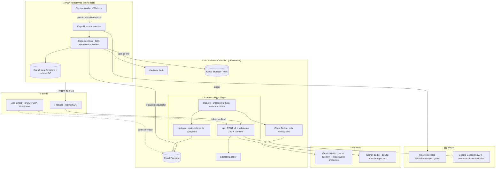

# encuentrame.bo — Plan Maestro de Arquitectura y Ejecución

**Versión:** 1.0 · **Fecha:** 2026-08-16 · **Autor:** Equipo de Arquitectura (sesión Cowork)
**Proyecto GCP:** `encuentramebo-1` · **Repositorio:** `github.com/segurolotengopy/ecuentrame.bo`
**Decisiones confirmadas:** React + Vite PWA · Mapas híbrido (MapLibre/OSM + Google Geocoding) · MVP completo · Infraestructura GCP/Firebase

---

## 0. Resumen ejecutivo

encuentrame.bo se construirá como una **PWA offline-first** sobre una fundación **100% serverless en GCP/Firebase**, diseñada para operar en condiciones de conectividad 2G/3G y dispositivos de gama baja. La arquitectura traduce el diseño AWS original a su equivalente GCP:

| Concepto | Diseño AWS original | Equivalente GCP/Firebase adoptado |
|---|---|---|
| Hosting + despliegue | Amplify | Firebase Hosting (CDN global) + GitHub Actions |
| Autenticación | Cognito | Firebase Authentication (Google OAuth, email, anónimo) |
| Verificación de foto | Rekognition | Vertex AI — Gemini multimodal (visión) |
| Voz → inventario | Bedrock (Claude/Titan) | Vertex AI — Gemini (audio + extracción estructurada JSON) |
| Base de datos | DynamoDB | Cloud Firestore (Native mode) con persistencia offline |
| Lógica de negocio | Lambda | Cloud Functions for Firebase 2ª gen (Node 20, TypeScript) |
| Archivos/fotos | S3 | Cloud Storage for Firebase |
| Geolocalización | Location Service | Geohashing en Firestore + MapLibre GL (tiles OSM) + Google Geocoding API (bajo volumen) |
| Colas / asincronía | SQS/Kinesis | Cloud Tasks + Eventarc + triggers de Firestore/Storage |
| Notificaciones | Pinpoint | Firebase Cloud Messaging (fase 2) |
| Anti-abuso | WAF | Firebase App Check (reCAPTCHA Enterprise) + cuotas por usuario |

---

## 1. Diagrama conceptual



**Flujo crítico — apertura de puesto:** el vendedor toma la foto → sube a Cloud Storage (reintento offline automático) → trigger `onOpeningPhoto` encola en Cloud Tasks → Gemini visión valida que sea un puesto y extrae etiquetas de productos → la función escribe `openings/{id}` con estado `verified` + geohash del GPS → el mapa del comprador lo refleja en tiempo real vía listener de Firestore. La lectura nunca espera a la IA: la UI muestra "verificando…" de forma optimista.

---

## 2. Los 9 pilares estratégicos

### 2.1 Capa de Base de Datos (Single Source of Truth)

**Motor:** Cloud Firestore (Native mode), región `us-central1` (mejor latencia/costo hacia Bolivia entre las regiones con Vertex AI completo).

**Esquema central** (colecciones raíz; Firestore es el SSOT, el cliente solo cachea):

```
users/{uid}                     # perfil; roles: buyer|seller|both; datos KYC mínimos
stalls/{stallId}                # puesto: ownerUid, nombre, categoría, dirección opcional, estado
  └─ products/{productId}      # subcolección: nombre normalizado, refId a master, precio, stock, fuente (voz|foto|manual)
openings/{openingId}            # evento de apertura: stallId, ownerUid, fecha, geohash, geopoint, fotoRef, estado(pending|verified|rejected), etiquetasIA
ledgers/{uid}/entries/{id}      # contabilidad simple por voz (base del historial financiero)
master_categories/{catId}       # tabla maestra de categorías (curada)
master_products/{prodId}        # tabla maestra de productos (anti-duplicados; alias[])
search_index/{shardId}          # meta-índice de búsqueda (ver 2.·caché/meta-indexing)
geo_tiles/{geohash4}            # pre-agrupación de puestos abiertos por celda geohash
config/{doc}                    # parámetros operativos (feature flags, cuotas)
```

**Reglas de modelado para alta concurrencia:**
- Documentos pequeños (< 5 KB) y desnormalización controlada: el nombre del puesto se copia en `openings` para evitar joins en el mapa.
- Contadores distribuidos (shards de 10) para métricas de aperturas diarias — evita contención de escritura en documentos calientes.
- `openings` es *append-only* (evento inmutable): el histórico de aperturas es la base del historial financiero verificable; jamás se edita, solo se agrega.
- **Migraciones:** carpeta `infra/migrations/` con scripts TypeScript idempotentes numerados (`001_seed_categories.ts`…), ejecutados vía CI con registro en `config/migrations`. Firestore no tiene DDL: las migraciones transforman datos y despliegan índices (`firestore.indexes.json` versionado en el repo = fuente de verdad de índices).
- **Particionamiento:** natural por documento en Firestore (no requiere sharding manual). La pre-agrupación geoespacial usa celdas geohash de precisión 4–6 como "particiones lógicas" de lectura.

### 2.2 Seguridad a nivel de fila (RLS)

Firestore no es SQL: el equivalente exacto de RLS son las **Security Rules evaluadas en el motor de base de datos**, imposibles de eludir desde el cliente aunque la capa de aplicación falle. Políticas núcleo:

```
match /stalls/{stallId} {
  allow read: if true;                                  // catálogo público
  allow create: if isSeller() && request.resource.data.ownerUid == request.auth.uid
                && validStallSchema();
  allow update, delete: if resource.data.ownerUid == request.auth.uid;   // aislamiento por dueño
}
match /stalls/{stallId}/products/{p} {
  allow read: if true;
  allow write: if get(/databases/$(db)/documents/stalls/$(stallId)).data.ownerUid == request.auth.uid;
}
match /ledgers/{uid}/{document=**} {
  allow read, write: if request.auth.uid == uid;        // contabilidad estrictamente privada
}
match /openings/{id} {
  allow read: if true;
  allow create: if request.resource.data.ownerUid == request.auth.uid && validOpening();
  allow update, delete: if false;                       // inmutable: solo Cloud Functions (Admin SDK)
}
match /master_products/{id} { allow read: if true; allow write: if false; }  // solo backend
match /search_index/{id}    { allow read: if true; allow write: if false; }
```

- Validación de esquema **dentro de las reglas** (tipos, tamaños, campos permitidos) — segunda línea tras Zod en el cliente/API.
- `request.auth.token` + custom claims (`seller: true`) asignados por Cloud Function al completar el perfil.
- **App Check obligatorio** en Firestore, Storage y Functions: solo la PWA legítima (atestada por reCAPTCHA Enterprise) puede llamar, mitigando scraping y bots.
- Tests de reglas con `@firebase/rules-unit-testing` en el emulador — suite obligatoria en CI (ningún deploy si una regla rompe el aislamiento).

### 2.3 Control de versiones y flujo de trabajo

- **Estrategia:** Trunk-Based Development. `main` siempre desplegable; ramas cortas `feat/…`, `fix/…` (< 3 días); PR obligatorio con 1 aprobación + CI verde.
- **Convenciones:** Conventional Commits (`feat:`, `fix:`, `chore:`…) validados por commitlint + husky. Versionado **SemVer automatizado** con semantic-release (tags + CHANGELOG generado).
- **Reviews automatizados:** CI ejecuta lint (ESLint + Prettier), typecheck estricto, tests unitarios (Vitest), tests de Security Rules en emulador, y build. CodeQL para análisis estático de seguridad.
- **Previews:** cada PR despliega un **Firebase Hosting Preview Channel** efímero (URL única, expira en 7 días) — revisión visual sin tocar producción.
- **Nota:** el repositorio actual se llama `ecuentrame.bo` (falta la "n"). Recomiendo renombrarlo a `encuentrame.bo` en GitHub Settings → General (GitHub redirige automáticamente la URL antigua, sin ruptura).

### 2.4 Arquitectura API-First

- **Estilo:** REST versionado (`/v1/...`) servido por una única Cloud Function `api` (Hono sobre Node 20 — framework de 20 KB, arranque frío mínimo), completamente **stateless** (JWT de Firebase Auth en `Authorization: Bearer`).
- **Contratos estrictos:** esquemas **Zod** en `packages/shared` son la única fuente de verdad de los payloads; de ellos se genera el **OpenAPI 3.1** (`zod-openapi`) publicado en `/v1/openapi.json` + Swagger UI en staging. El frontend consume tipos TypeScript derivados de los mismos esquemas: imposible desincronizar cliente y servidor.
- **Superficie v1:**

| Endpoint | Método | Función |
|---|---|---|
| `/v1/openings` | POST | Registrar apertura (foto ya subida; valida, encola verificación IA) |
| `/v1/openings/{id}/close` | POST | Cierre de puesto |
| `/v1/inventory/voice` | POST | Audio → Gemini → propuesta estructurada de productos (confirmación preventiva en UI) |
| `/v1/search` | GET | Búsqueda por categoría/producto/nombre + bounding box geohash |
| `/v1/geocode` | GET | Proxy con caché a Google Geocoding (la llave jamás llega al cliente) |
| `/v1/ledger/voice` | POST | Audio → asiento contable simple |

- Lecturas de alto volumen (mapa en vivo, detalle de puesto) van **directo a Firestore por SDK** bajo Security Rules — patrón Firebase canónico que elimina un salto de red; la API concentra escrituras complejas y orquestación IA.

### 2.5 Despliegue y alojamiento (Zero-Downtime)

- **Todo serverless:** Firebase Hosting (estáticos + CDN), Cloud Functions 2ª gen (basadas en Cloud Run: revisiones inmutables, rollback instantáneo, `minInstances: 1` solo para `api` en producción para eliminar arranque frío del camino crítico).
- **Pipeline GitHub Actions:**

```
PR  → lint + typecheck + test + rules-test (emulador) + build → preview channel
main → todo lo anterior + semantic-release → deploy Hosting + Functions + Rules + Indexes (staging implícito vía preview) → smoke test post-deploy
```

- Despliegue atómico: Hosting publica versiones inmutables (rollback de 1 clic); Functions 2ª gen migran tráfico entre revisiones sin caída; reglas e índices se despliegan antes que el código que depende de ellos (orden garantizado en el workflow).
- **Autenticación del pipeline: Workload Identity Federation** — GitHub Actions se federa contra GCP sin llaves estáticas (sección 4).
- Entornos: `producción = encuentramebo-1`; recomiendo crear `encuentramebo-dev` (gratis, plan Spark) como entorno de juego + el **Emulator Suite** para desarrollo local sin costo.

### 2.6 Alta seguridad (Zero-Trust, OWASP Top 10)

- **Identidad:** Firebase Auth con Google OAuth + email/contraseña (verificación de correo obligatoria) + sesión anónima para compradores. Tokens JWT de 1 h con rotación automática por refresh token; revocación server-side al detectar abuso. Custom claims para autorización por rol.
- **Zero-Trust en tres anillos:** (1) App Check atesta el cliente, (2) Security Rules validan identidad + esquema en el dato, (3) la API revalida todo con Zod + claims. Ninguna capa confía en la anterior.
- **Cifrado:** TLS 1.3 automático (Hosting/Functions); cifrado en reposo por defecto en Firestore/Storage (AES-256, llaves gestionadas por Google).
- **Secretos:** Google Secret Manager para la llave de Geocoding y credenciales de terceros; inyección como variables en Functions. **Prohibido** cualquier secreto en el repo (gitleaks en CI lo bloquea).
- **OWASP Top 10 — mitigaciones clave:** inyección (Zod + Firestore parametrizado por diseño), broken access control (Rules + claims + tests), SSRF (sin fetch de URLs de usuario), componentes vulnerables (Dependabot + `npm audit` en CI), logging/monitoring (Cloud Logging + alertas de presupuesto y de tasa de error).
- **Privacidad del vendedor** (requisito del FAQ): la ubicación puede publicarse como celda geohash (~150 m) en vez del punto exacto — opción "radio de proximidad" por puesto; visible solo mientras el puesto esté abierto.
- **Hallazgo crítico inmediato:** `Carlos Key.txt` y `Luan Key.txt` contienen **claves AWS activas en texto plano** dentro de la carpeta compartida. Deben **desactivarse/rotarse hoy** en la consola IAM de AWS (aunque el proyecto migre a GCP, esas llaves siguen siendo válidas para quien las encuentre) y eliminarse los archivos. Nunca almacenar llaves en carpetas de documentos.

### 2.7 Rate Limiting y Throttling

- **Capa 1 — App Check:** corta bots y scripts (el costo de ataque sube drásticamente).
- **Capa 2 — middleware de la API:** ventana deslizante por `uid` y por IP (almacén en Firestore con TTL, sin costo de Redis en MVP): p. ej. `POST /openings` máx. 20/día/vendedor (negocio real: ~1–3), `inventory/voice` 60/día, `search` 120/min/usuario, `geocode` 10/min. HTTP 429 con `Retry-After`.
- **Capa 3 — cuotas de plataforma:** límites de concurrencia por función (`maxInstances`) como cortacircuito de costo, presupuesto GCP con alertas al 50/80/100 %, y cuotas de API de Google (Geocoding) fijadas en consola.
- Los endpoints con IA (los más caros) tienen además **presupuesto por usuario** en `config/quotas` — el sistema degrada a entrada manual si un usuario agota su cupo de voz.

### 2.8 Estrategia de caché multinivel (+ meta-indexing y asincronía)

| Nivel | Tecnología | Qué cachea | Invalidación |
|---|---|---|---|
| L0 dispositivo | Persistencia offline Firestore + IndexedDB | Datos del vendedor, último mapa visto | Automática por listeners (event-driven) |
| L1 aplicación | TanStack Query | Respuestas de `/v1/search`, geocoding | stale-while-revalidate, TTL 60 s búsquedas |
| L2 borde | CDN Firebase Hosting | Estáticos inmutables (hash en nombre), tiles | `Cache-Control: immutable` 1 año |
| L3 función | LRU en memoria de la instancia | Tablas maestras, config, geocoding repetido | TTL 5 min + versión en `config` |
| L4 datos | Colecciones precomputadas | `geo_tiles`, `search_index` | **Event-driven por triggers** (sin lecturas sucias) |

- **Meta-indexing (pilar del skill mejora-proyectos):** la búsqueda nunca escanea `stalls`/`products` (O(n)). Un trigger `onWrite` en productos/aperturas actualiza `search_index` (tokens normalizados sin acentos, prefijos para autocompletar, referencia a `master_products`) y `geo_tiles/{geohash4}` (lista compacta de puestos abiertos por celda). El mapa lee **1 documento por celda visible** (O(celdas)), y la búsqueda resuelve por índice invertido (O(1) amortizado). Escritura del índice desacoplada de la lectura en tiempo real: si el indexador se atrasa 2 s, el mapa sigue sirviendo la última versión consistente.
- **Asincronía estratégica:** verificación de foto (Vision) y extracción de voz corren fuera del hilo de la petición vía Cloud Tasks (reintentos exponenciales, dead-letter a `openings_failed` para revisión). Escrituras idempotentes por `openingId` determinista = sin condiciones de carrera con el usuario reintentando offline. Toda promesa en Functions tiene manejo de error y timeout explícito (sin promesas huérfanas: `Promise.allSettled` + logging estructurado).

### 2.9 Frontend estructurado

- **Stack:** React 18 + Vite + TypeScript estricto · Tailwind CSS · `vite-plugin-pwa` (Workbox) · TanStack Query (estado servidor) + Zustand (estado UI global mínimo) · React Router · MapLibre GL JS · react-hook-form + Zod.
- **Arquitectura por features** con separación estricta UI ↔ servicios: los componentes jamás importan el SDK de Firebase; consumen hooks de `features/*/api.ts` que delegan en `services/` (adaptadores). Cambiar de proveedor no toca la UI.
- **Rendimiento (Core Web Vitals) para 2G/3G y gama baja:** code-splitting por ruta; MapLibre en chunk diferido; presupuesto de bundle inicial **< 170 KB gzip** (verificado en CI con size-limit); imágenes WebP redimensionadas server-side (extensión Resize Images); precache del shell por service worker → segunda visita instantánea y **funcional offline**; fuentes del sistema (0 KB).
- **Accesibilidad para el usuario real:** iconos grandes, flujo "1 foto = abierto", dictado por voz como entrada primaria, textos cortos en español, modo alto contraste — la interfaz debe poder usarla quien sabe mandar un audio de WhatsApp.

---

## 3. Estructura de directorios (monorepo pnpm)

```
encuentrame.bo/
├─ apps/
│  └─ web/                        # PWA React + Vite
│     ├─ src/
│     │  ├─ app/                  # bootstrap, router, providers, guardas de rol
│     │  ├─ components/ui/        # componentes base reutilizables (Button, Card, Map…)
│     │  ├─ features/
│     │  │  ├─ auth/              # login, registro, OAuth Google
│     │  │  ├─ seller/            # panel: puestos, apertura-foto, inventario-voz, histórico
│     │  │  ├─ buyer/             # mapa vivo, búsqueda, detalle de puesto
│     │  │  └─ landing/           # página pública prerenderizada (SEO)
│     │  ├─ services/             # firebase.ts, api-client.ts (generado de OpenAPI), geo.ts
│     │  ├─ stores/               # Zustand
│     │  └─ lib/                  # utilidades puras (testeadas)
│     └─ vite.config.ts
├─ functions/                     # Cloud Functions 2ª gen (TypeScript)
│  └─ src/
│     ├─ api/                     # Hono: rutas v1, middleware auth/appcheck/ratelimit
│     ├─ triggers/                # onOpeningPhoto, onProductWrite (indexer), onUserCreate
│     ├─ services/                # vertex.ts (visión/voz), geocode.ts, quotas.ts
│     └─ index.ts
├─ packages/
│  └─ shared/                     # esquemas Zod + tipos + constantes (contrato único)
├─ infra/
│  ├─ firestore.rules             # RLS
│  ├─ firestore.indexes.json
│  ├─ storage.rules
│  ├─ migrations/                 # 001_seed_categories.ts, 002_seed_master_products.ts…
│  └─ setup/bootstrap-gcp.sh      # aprovisionamiento one-time (lo ejecuta el Owner)
├─ tests/
│  ├─ rules/                      # tests de Security Rules (emulador)
│  └─ load/                       # k6: load, stress, spike, soak (sección 5)
├─ .github/workflows/             # ci.yml, deploy.yml (WIF), preview.yml
├─ firebase.json · .firebaserc · pnpm-workspace.yaml · turbo.json
└─ docs/                          # este plan, OpenAPI, runbooks
```

---

## 4. Administración segura del proyecto GCP `encuentramebo-1`

**Hallazgo:** las llaves guardadas en la carpeta (`Carlos Key.txt`, `Luan Key.txt`) son de **AWS IAM** — no aplican a GCP. La cuenta `alberdi.andres@gmail.com` es Owner, pero una cuenta de usuario Google no tiene llaves descargables (y jamás deben usarse credenciales de Owner para operar). El procedimiento correcto, de mínimo privilegio y en dos vías complementarias:

### Vía A (obligatoria) — CI/CD sin llaves con Workload Identity Federation
El despliegue rutinario lo hace GitHub Actions federándose contra GCP: **ninguna llave estática existe en ningún lado**. El Owner ejecuta una sola vez, en Cloud Shell (consola GCP → icono >_ ):

```bash
gcloud config set project encuentramebo-1

# 1. Service account de despliegue (mínimo privilegio, sin Owner/Editor)
gcloud iam service-accounts create deployer --display-name="CI Deployer"
SA=deployer@encuentramebo-1.iam.gserviceaccount.com
for R in roles/firebasehosting.admin roles/cloudfunctions.developer \
         roles/firebaserules.admin roles/datastore.indexAdmin \
         roles/iam.serviceAccountUser roles/serviceusage.serviceUsageConsumer \
         roles/run.viewer roles/cloudscheduler.admin; do
  gcloud projects add-iam-policy-binding encuentramebo-1 --member="serviceAccount:$SA" --role="$R"
done

# 2. Pool de identidad federada vinculado al repositorio GitHub
gcloud iam workload-identity-pools create github --location=global
gcloud iam workload-identity-pools providers create-oidc github-oidc \
  --location=global --workload-identity-pool=github \
  --issuer-uri="https://token.actions.githubusercontent.com" \
  --attribute-mapping="google.subject=assertion.sub,attribute.repository=assertion.repository" \
  --attribute-condition="assertion.repository=='segurolotengopy/ecuentrame.bo'"

# 3. Permitir que SOLO ese repo actúe como el deployer
PROJECT_NUMBER=$(gcloud projects describe encuentramebo-1 --format='value(projectNumber)')
gcloud iam service-accounts add-iam-policy-binding $SA \
  --role=roles/iam.workloadIdentityUser \
  --member="principalSet://iam.googleapis.com/projects/$PROJECT_NUMBER/locations/global/workloadIdentityPools/github/attribute.repository/segurolotengopy/ecuentrame.bo"
```

El workflow `deploy.yml` que entregaré usa `google-github-actions/auth@v2` con ese proveedor. Resultado: *push a main = deploy auditado, sin secretos*.

### Vía B (opcional) — acceso directo de esta sesión para construir/probar
Si quieren que yo despliegue directamente desde esta sesión (útil durante la construcción inicial), el Owner crea una **segunda** service account de alcance limitado y me entrega su llave **temporal**:

```bash
gcloud iam service-accounts create cowork-builder --display-name="Cowork Builder (temporal)"
SA2=cowork-builder@encuentramebo-1.iam.gserviceaccount.com
for R in roles/firebasehosting.admin roles/cloudfunctions.developer \
         roles/firebaserules.admin roles/datastore.user roles/storage.objectAdmin \
         roles/iam.serviceAccountUser roles/serviceusage.serviceUsageConsumer; do
  gcloud projects add-iam-policy-binding encuentramebo-1 --member="serviceAccount:$SA2" --role="$R"
done
gcloud iam service-accounts keys create cowork-builder-key.json --iam-account=$SA2
```

Reglas de higiene: la llave se coloca en la carpeta conectada (yo la tomo por el puente de archivos, nunca pegada en texto del chat si es evitable), se usa durante la construcción, y al terminar se ejecuta `gcloud iam service-accounts keys delete` (o se borra la SA completa). Caducidad recomendada: 7 días.

### Aprovisionamiento inicial (lo ejecuta el Owner una vez, Cloud Shell)

```bash
# Habilitar APIs
gcloud services enable firestore.googleapis.com cloudfunctions.googleapis.com \
  run.googleapis.com cloudbuild.googleapis.com aiplatform.googleapis.com \
  secretmanager.googleapis.com cloudtasks.googleapis.com \
  firebaseappcheck.googleapis.com identitytoolkit.googleapis.com \
  geocoding-backend.googleapis.com

# Crear base Firestore (Native) y bucket
gcloud firestore databases create --location=us-central1
# Consola Firebase: activar Authentication (Google + email), Storage, App Check
# Facturación: plan Blaze requerido para Functions/Vertex + presupuesto con alertas (sugerido: 25 USD/mes inicial)
```

### GitHub — endurecimiento del repositorio
Branch protection en `main` (PR + CI verde obligatorios, sin force-push) · secret scanning + push protection activados · Dependabot · CODEOWNERS · renombrar el repo a `encuentrame.bo` (typo actual: `ecuentrame.bo`; GitHub redirige la URL antigua). Invitar colaboradores con rol *Write*, jamás compartir la cuenta.

### Acción inmediata de seguridad
Rotar/desactivar **hoy** las llaves AWS de `Carlos Key.txt` y `Luan Key.txt` (Consola AWS → IAM → Users → Security credentials → Deactivate) y eliminar ambos archivos de la carpeta. Son credenciales activas en texto plano.

---

## 5. Suite de pruebas de carga (k6) — diseño

Herramienta: **k6** (stack JS, se integra a CI, soporta escenarios y umbrales declarativos). Objetivos sobre entorno staging/emulador con datos sintéticos (500 puestos, 5 000 productos):

| Escenario | Perfil | Aserciones clave |
|---|---|---|
| **Load** | 200 VUs, 10 min — mezcla 80 % `/v1/search` + lecturas mapa, 15 % aperturas, 5 % voz (mock) | p95 < 800 ms en búsqueda, p95 < 1.5 s en apertura (sin IA), error rate < 0.5 % |
| **Stress** | ramp 0→1 000 VUs en 15 min | Identificar rodilla de la curva; verificar que `maxInstances` corta antes que el presupuesto; sin 5xx en Firestore (solo 429 controlados) |
| **Spike** | 50→600 VUs en 10 s (feria abre 8:00 am) | Cola de Cloud Tasks absorbe el pico; ninguna verificación perdida; recuperación < 2 min a p95 nominal |
| **Soak** | 150 VUs, 4 h | Sin degradación > 10 % de p95 entre hora 1 y 4; memoria de instancias estable (sin leaks); cero promesas sin resolver en logs |

Integridad transaccional: el escenario de escritura concurrente dispara 50 aperturas simultáneas del **mismo** puesto — la aserción verifica que la idempotencia por `openingId` determinista deja exactamente 1 documento y 0 estados inconsistentes. Los scripts (`tests/load/*.js`) se generan en la fase de construcción; contra servicios de IA se usan mocks para no facturar Vertex en pruebas.

---

## 6. Plan de ejecución por fases

| Fase | Entregable | Duración estimada |
|---|---|---|
| **F0 — Fundación** | Bootstrap GCP (Owner ejecuta sección 4) · monorepo · CI/CD con WIF · emulador local · reglas base + tests | 1 sesión |
| **F1 — Identidad** | Landing prerenderizada · registro/login (Google + email) · perfiles y roles · App Check | 1–2 sesiones |
| **F2 — Vendedor** | CRUD de puestos · apertura con foto + pipeline Vertex (visión) · geohash · cierre · histórico | 2–3 sesiones |
| **F3 — Inventario IA** | Voz → Gemini → productos con confirmación preventiva · tablas maestras anti-duplicado · contabilidad simple | 2 sesiones |
| **F4 — Comprador** | Mapa vivo MapLibre + geo_tiles · búsqueda multi-criterio vía search_index · detalle de puesto | 2 sesiones |
| **F5 — Endurecimiento** | Rate limiting completo · k6 (4 escenarios) · presupuestos/alertas · auditoría OWASP · runbooks | 1–2 sesiones |

**Costo operativo estimado del MVP** (100 vendedores, 1 000 compradores/mes): Firestore + Functions + Hosting ≈ 0–5 USD (mayormente capa gratuita del plan Blaze) · Vertex AI (Gemini Flash, ~3 000 verificaciones + 6 000 audios) ≈ 5–15 USD · Geocoding (proxy cacheado) ≈ 0–3 USD · **Total ≈ 10–25 USD/mes**, con alerta de presupuesto en 25 USD.

---

## 7. Aprobaciones requeridas

1. **Aprobación del plan maestro** para iniciar F0 (scaffolding del monorepo y código completo).
2. Decidir **Vía A sola** (CI/CD despliega; ustedes configuran WIF con mi guía) o **Vía A + B** (además me entregan la llave temporal `cowork-builder` para desplegar yo directamente).
3. Confirmar la ejecución de la **rotación de las llaves AWS** expuestas.
4. (Opcional) Renombrar el repositorio a `encuentrame.bo`.
